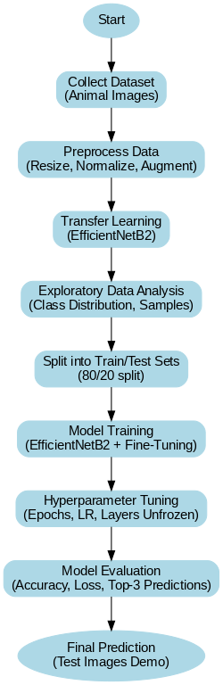
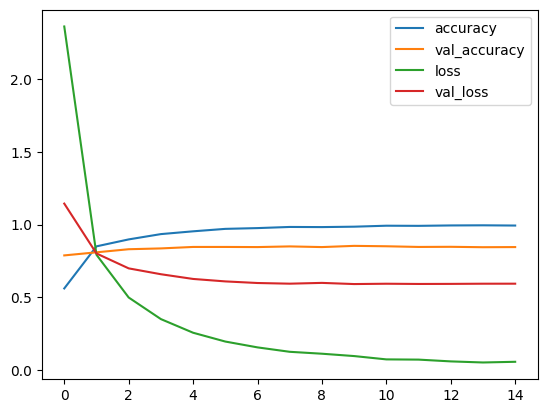
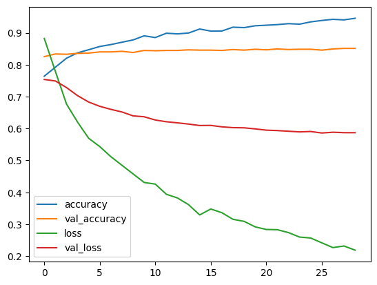
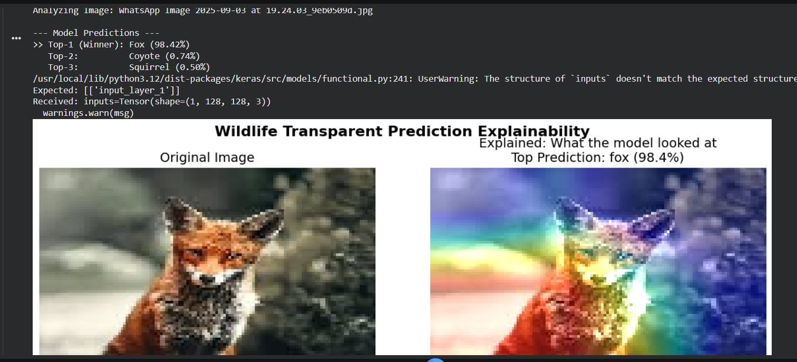

# 🐾 Wildlife Species Recognition using Deep Learning (EfficientNet + XAI)

<p align="center">
  
  
  
  
  
</p>

---

## 📖 Project Overview

This project presents a deep learning system capable of recognizing approximately **90 wildlife species** from natural images. The model leverages **transfer learning with EfficientNet**, followed by selective fine-tuning to improve domain adaptation and generalization.

Beyond classification, the system integrates **Explainable AI (XAI)** techniques such as Grad-CAM to visually interpret model decisions. This ensures transparency and builds confidence in model predictions.

The project was developed under academic constraints using Google Colab and optimized for student-level hardware.

---

## 🎯 Key Objectives

- Develop a multi-class wildlife classifier (~90 categories)
- Apply transfer learning using EfficientNet backbone
- Implement staged training (feature extraction + fine-tuning)
- Optimize runtime for limited hardware
- Provide Top-1 and Top-3 predictions
- Enable visual interpretability using Grad-CAM
- Maintain a clean, professional ML repository structure

---

## 📂 Dataset Description

The dataset consists of wildlife images organized by species in directory format compatible with `image_dataset_from_directory()`.

Each class contains images under varying:

- Lighting conditions  
- Background environments  
- Viewing angles  
- Animal poses  

### Example Classes
Tiger, Lion, Bear, Zebra, Elephant, Owl, Panda, Dolphin, Wolf, Kangaroo, and many more.

### Dataset Structure

```
dataset/
 ├── tiger/
 ├── lion/
 ├── bear/
 ├── owl/
 ├── zebra/
 └── ...
```

> Note: Dataset and trained models are excluded due to GitHub size limits.

---

## 🧠 Model Architecture

### Backbone: EfficientNet (ImageNet Pretrained)

EfficientNet was chosen because:

- Strong performance-to-parameter ratio  
- Efficient scaling strategy  
- Robust feature extraction capability  
- Faster convergence compared to training from scratch  

### Architecture Flow

<p align="center">
  
</p>

EfficientNet Base → Global Average Pooling → Dropout → Dense (Softmax Output)

---

## 🔄 Training Strategy

### Phase 1 – Feature Extraction
- Freeze pretrained layers
- Train classification head
- Faster convergence
- Prevents early overfitting

### Phase 2 – Fine-Tuning
- Unfreeze last N layers
- Use low learning rate (1e-5)
- Improve feature specialization for wildlife domain

This staged strategy ensures stable learning and better generalization.

---

## 📉 Optimization Techniques

- ModelCheckpoint (save best validation model)
- EarlyStopping (avoid overfitting)
- ReduceLROnPlateau (dynamic LR adjustment)
- Data augmentation
- Reduced image resolution for faster training
- TPU/GPU compatibility
- Mixed precision (optional performance boost)

---

## 📊 Training Performance

<p align="center">
  
  
</p>

The model demonstrates stable convergence with minimal validation gap after fine-tuning.

---

## 🔍 Prediction System

The prediction pipeline:

1. Load trained `.keras` model  
2. Preprocess image using EfficientNet preprocessing  
3. Generate probability distribution  
4. Display Top-1 + Top-3 predictions  

### Example Output

```
Predicted Animal: tiger (0.96)

Top-3 Predictions:
tiger: 0.96
cat: 0.03
owl: 0.00
```

This provides interpretable and confidence-aware classification results.

---

## 🧪 Explainable AI (Grad-CAM)

To increase model transparency, Grad-CAM visualization highlights the image regions influencing the final prediction.

<p align="center">
  
</p>

This ensures interpretability and validates the reasoning behind predictions.

---

## 💻 Hardware Requirements

### Minimum
- 8GB RAM  
- CPU (slow but feasible)  

### Recommended
- Google Colab GPU  
- TPU v2-8  
- 12GB+ RAM  

The project was optimized to prevent runtime crashes in free-tier environments.

---

## 📦 Installation

Create a virtual environment and install dependencies:

```bash
pip install -r requirements.txt
```

### Core Dependencies

- tensorflow
- numpy
- matplotlib
- opencv-python
- scikit-learn
- Pillow

---

## 🚀 How to Run

1. Open training notebook in Google Colab  
2. Mount Google Drive (if required)  
3. Train the model  
4. Save `.keras` model  
5. Run prediction cell  
6. Upload test image  

---

## 📁 Repository Structure

```
wildlife-species-recognition-xai/
│
├── training_notebook.ipynb
├── explainable_model.ipynb
├── README.md
├── requirements.txt
├── assets/
│   ├── prediction_demo.png
│   ├── training_graph.png
│   ├── architecture_diagram.png
│   └── gradcam_example.png
└── .gitignore
```

Large files such as the dataset and trained models are excluded.

---

## 🔮 Future Enhancements

- Deploy as a Streamlit web application  
- Add live camera prediction  
- Improve handling of class imbalance  
- Integrate interactive Grad-CAM overlays  
- Convert model to TensorFlow Lite for edge deployment  
- Add automated evaluation dashboard  

---

## 👨‍🎓 Academic Note

This project was developed through iterative experimentation, hyperparameter tuning, and debugging. Multiple configurations were tested before selecting the final training pipeline. The focus was not only achieving strong accuracy but also ensuring stability, interpretability, and reproducibility.

---

## 📜 License

This project is intended for academic and educational purposes.

---
